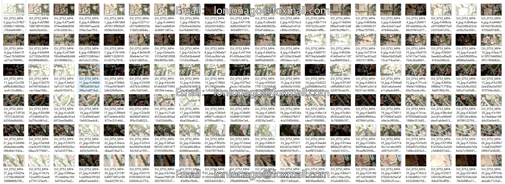
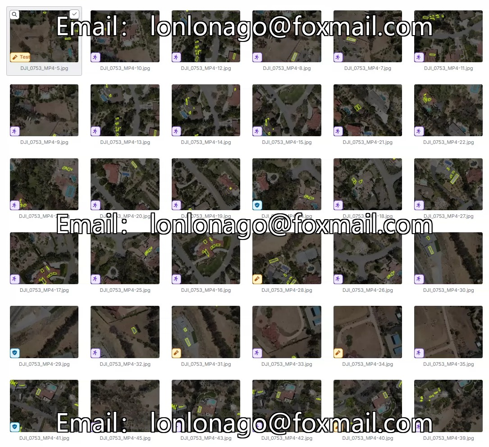
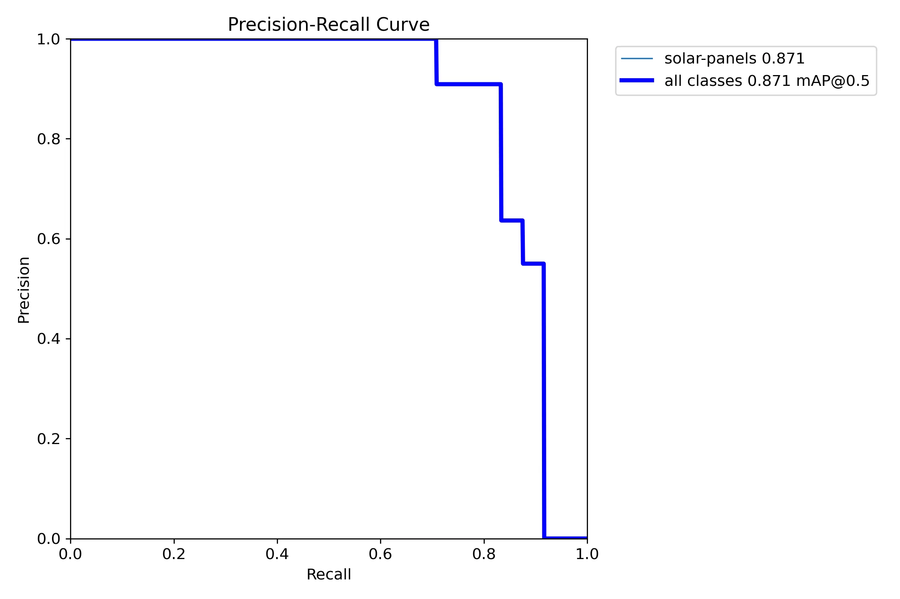
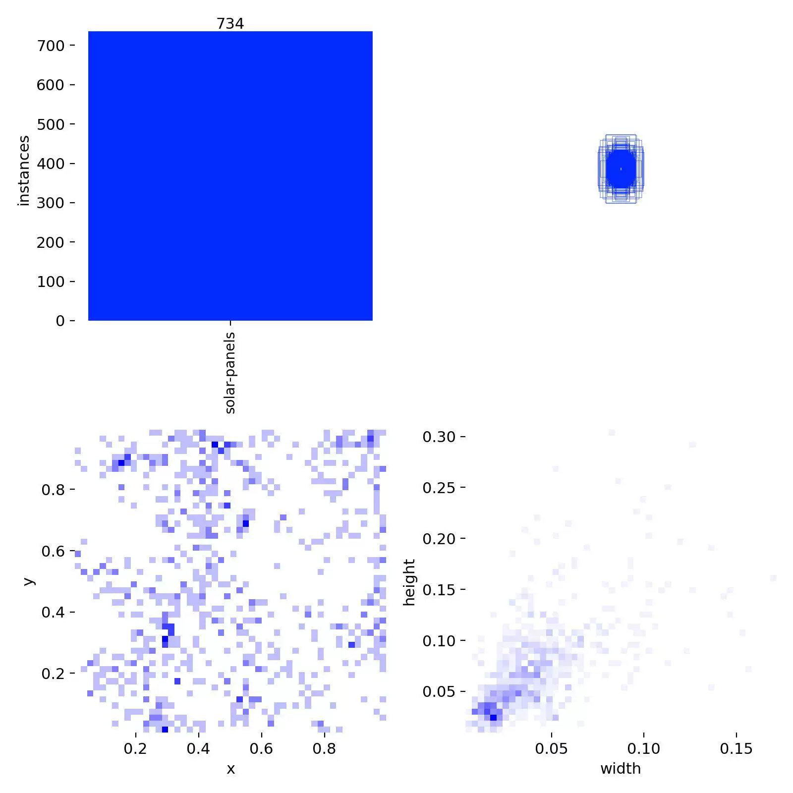
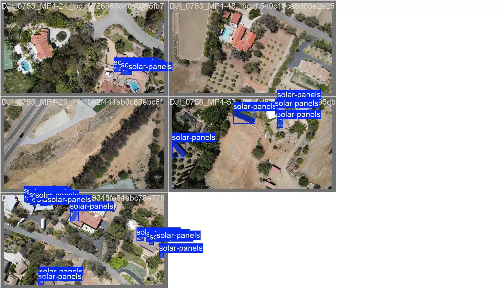
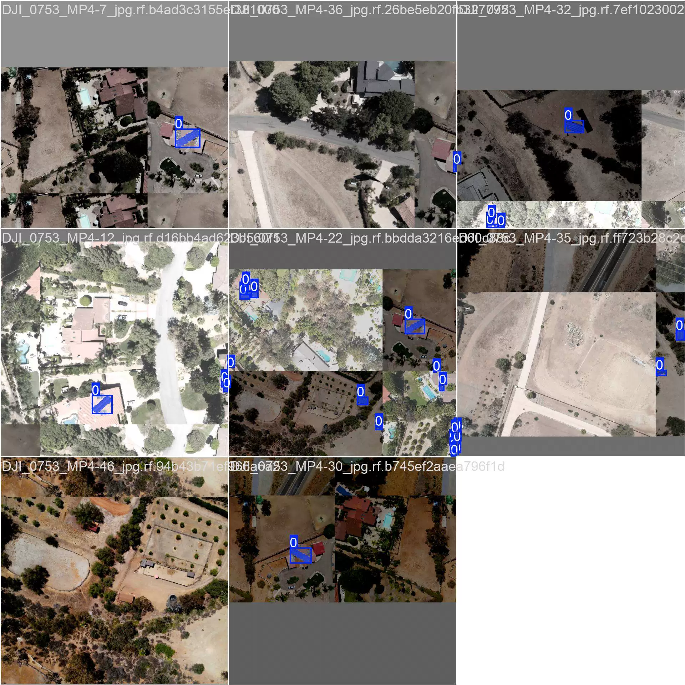
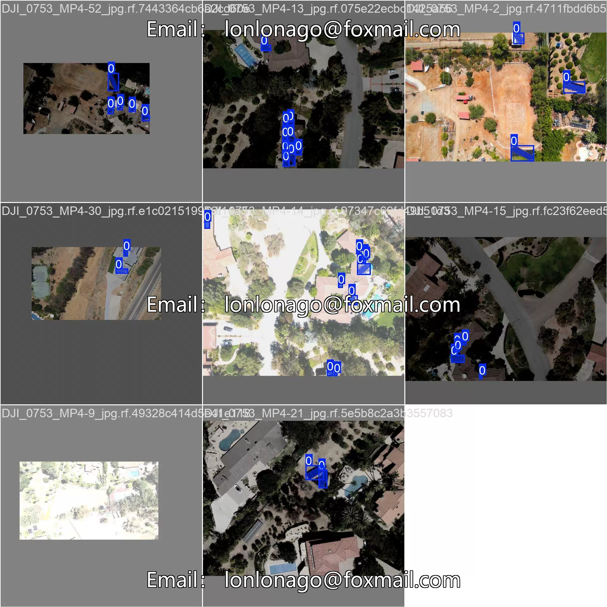
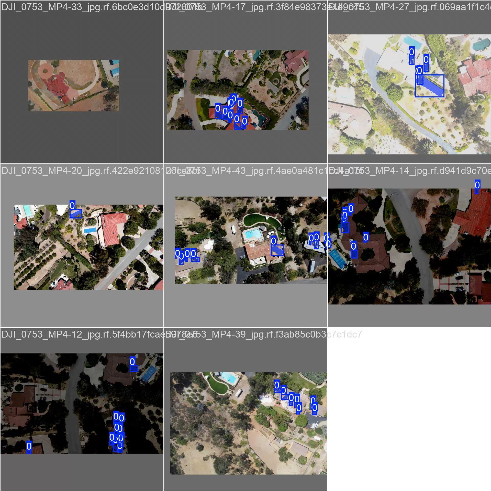

## Body

The dataset for drone target recognition (segmentation) of solar panels/photovoltaic panels is in YOLO format.

There are a total of 179 images, each labeled with its corresponding category. The dataset has been divided into 1 class: solar-panels, which represent the solar panels.

The dataset includes a YOLOv11m-seg segmentation weight file (training rounds 100, pre-trained model YOLOv11m-seg.pt, mAP@0.5 0.871) along with the training results file.

## Images

Here is a pay link on Stripe ( https://buy.stripe.com/3cs8yP7sY87d0vu9AB ). Please contact me lonlonago@foxmail.com after funding $89, and I will send you a complete data files , thank you!

